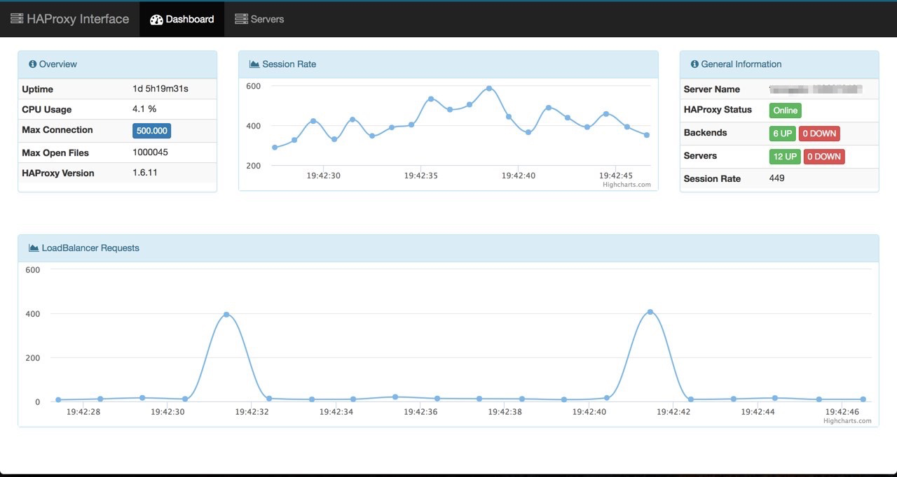
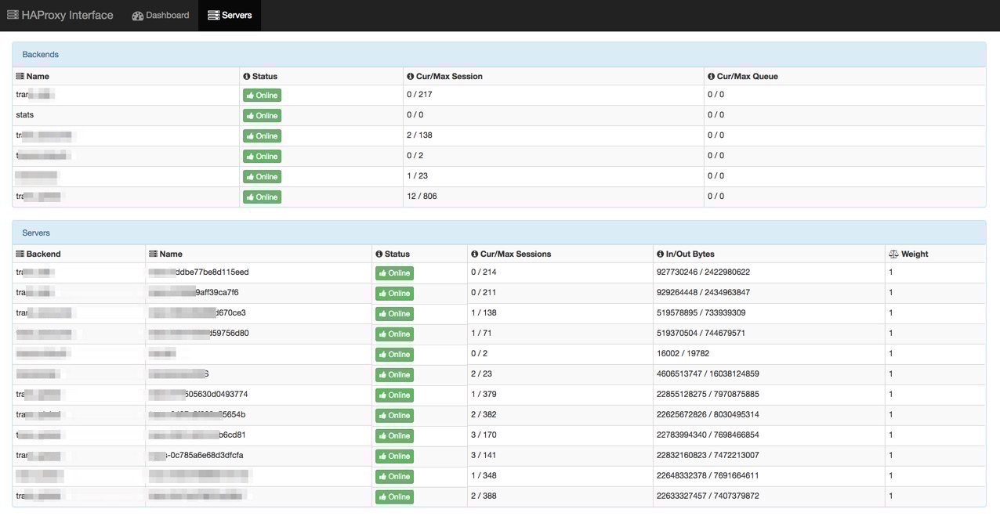

# How to execute

## Application Prereqs

* python
* python-dev
* pip
* virtualenv

## Activate virtualenv

`source bin/activate`

## Install requirements

`pip install -r src/web/requirements.txt`

or the command below for the api

`pip install -r src/api/requirements.txt`

## Rename config_example.py and configure src/api/config.py and src/web/config.py

`cp -rf src/api/config_example.py cp -rf src/api/config.py`

`cp -rf src/web/config_example.py cp -rf src/web/config.py`

```
haproxy_socket = dict(                                                                                                                                        
    DIR = '/tmp',
    FILE = 'stats',
)
```

## Execute the api app on the HAProxy server

`python src/api/main.py`

## Execute the web app wherever you want

`python src/web/main.py`

## Development environment

### Pre-reqs

  - Docker and docker-compose installed on your computer (https://docs.docker.com/engine/installation/)

### Starting

To start the environment, we'll use the `make` command as you can see below.

```
make build:	Create new development environment
make start:	Start development environment previously created
make stop:	Stop development environment
make status:	Show development environment
make restart:	Restart development environment
make logs:	Show development environment logs
make clean:	Clean dangling volume and images from docker
make help:	How to use make command
```

> **Note:**

> The first time you will need to run **make build**.

### Explaining Parameters

        - make build: When you want to create the environment executing again process such: migrate, deps install, requirements install, etc...;
        - make start: Just start the whole environment without change. This command does not execute the steps above;
        - make stop: As clear as water... To stop the environment;
        - make status: Another clear... Show environment status;
        - make restart: Do not need explanation;
        - make logs: Excellent way to see the logs of our containers;
        - make clean: Very important to clean you computer removing dangling volumes and images from docker;

### Accessing the environment

After the environment started, you can access by using the URL http://localhost:5000 on your browser.

## Some calls

### Web

`http://localhost:5000`

### API

`http://localhost:5001/api/v1/info`

`http://localhost:5001/api/v1/errors`

`http://localhost:5001/api/v1/frontends`

`http://localhost:5001/api/v1/backends`

`http://localhost:5001/api/v1/servers`

## Screenshots

**Dashboard:**



**Servers and Backends:**

